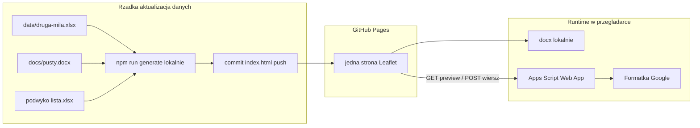

# ARCHITECTURE.md — Druga Mila

> **Status:** Szkic techniczny (Faza 2)  
> **Ostatnia aktualizacja:** 2026-07-20  
> **Na podstawie:** `docs/SPECIFICATION.md`  
> **Tworzony przez:** plan techniczny (wzorce UX z `arkusz-mapa`; **inny** model wdrożenia — strona statyczna)  
> **Zatwierdzony przez:** (do podpisu przed implementacją kodu)

---

## Cel Techniczny

**Jedna statyczna strona** mapowa na GitHub Pages, która:

1. Ma wbudowane punkty z Excela **Załadunek** (`data/druga-mila.xlsx`) — po rzadkim lokalnym buildzie.
2. Geokoduje adresy (cache) **tylko przy lokalnym** `npm run generate` (nie w cyklicznym CI).
3. Serwuje HTML (Leaflet): kolory CD / PLAC / puste / Bolęcin, search, filtr typu.
4. W przeglądarce: protokół Word (szablon DM) + POST do formatki Google — **bez** przebudowy strony.
5. Numeracja alfanumeryczna (`asd123` → `asd124`) przez Apps Script.
6. Reguła Bolęcin przy zbiórce zawierającej manualną (`manualna` / `manualna i automatyczna`) (JS modala).

Bez Symfony / Vue SPA / PostgreSQL w v1.  
Bez cyklicznej regeneracji jak w `arkusz-mapa` (brak schedule / cron → generate).

---

## Architektura wysokiego poziomu



| Warstwa | Technologia | Rola |
|---------|-------------|------|
| Punkty | Excel Załadunek w repo | Źródło pinezek + combobox; wbudowane w HTML przy buildzie |
| Podwykonawcy | `podwyko lista.xlsx` w repo | Przewoźnik / dostawa; wbudowane przy buildzie |
| Transporty | Google Sheets (formatka) + Apps Script | Numeracja, zapis wierszy (runtime) |
| Build | Node.js + TypeScript (lokalnie, rzadko) | Geocode, embed list, `buildMapHtml` → `index.html` w rootcie |
| UI | Leaflet w jednym HTML | Mapa, filtry, modal, Word |
| Hosting | GitHub Pages | Serwuje root brancha `main` (folder `/`; bez cyklicznego generate) |

---

## Dane

### Punkty — `data/druga-mila.xlsx` / arkusz Załadunek

| Kolumna | Użycie |
|---------|--------|
| A Nazwa pełna | Search, Sheets kontrahent, część Word |
| B Nazwa skrócona | Etykieta comboboxa, search |
| C Adres | Geocode (przy buildzie), search, Sheets adres, część Word |
| D Typ | `CD` / `PLAC` / puste → klasyfikacja koloru |

Klasyfikacja koloru (kolejność): Bolęcin (regex nazwa/adres) → CD → PLAC → puste.  
Hex: Bolęcin `#fd7e14`, CD `#0d6efd`, PLAC `#198754`, puste `#6f42c1`.

Wiersze bez C — pomijane na mapie i w comboboxie załadunku.

### Formatka Google

Wzór kolumn (offline): [`data/formatka-druga-mila.xlsx`](../data/formatka-druga-mila.xlsx). Mapowanie: [`FORMATKA_GOOGLE.md`](FORMATKA_GOOGLE.md) + SPEC.

**Docelowy arkusz online** (do niego Apps Script dopisuje wiersze):

- Nazwa: **lista-druga-mila**
- URL: `https://docs.google.com/spreadsheets/d/1-qRyFnpjvAI1pZYkVXOUKKV9oYlxGsLidDXCtxYWzS0/edit?usp=sharing`
- Spreadsheet ID: `1-qRyFnpjvAI1pZYkVXOUKKV9oYlxGsLidDXCtxYWzS0`
- Zakładka: `Arkusz1`
- Nagłówki (wiersz 1) **zweryfikowane** — 14 kolumn zgodnych z [`FORMATKA_GOOGLE.md`](FORMATKA_GOOGLE.md) / lokalnym wzorem: Numer faktury, Stawka, Czy protokół zrobiony, Nr zlecenia transportowego, Adres odbioru, Nazwa kontrahenta / podmiot handlowy, Data odbioru, Kto odbiera, Miejsce zrzutu, Rodzaj zbiórki, Ile worków, rodzaj traportu, awizacja, znacznik miejsca
- Apps Script Web App powinien być **container-bound** do tego arkusza (albo standalone + `SpreadsheetApp.openById('1-qRyFnpjvAI1pZYkVXOUKKV9oYlxGsLidDXCtxYWzS0')`).

> Uwaga: wcześniejszy link (`11OQsQn-…` / lista-druga-mila2) był błędny / niedostępny — nie używać.

### Word

[`pusty.docx`](pusty.docx) + [`SZABLON_WORD_tagi.md`](SZABLON_WORD_tagi.md).  
Tagi: `numer_zlecenia_transportowego`, `miejsce_zaladunku`, `przewoznik`, `miejsce_dostawy`, `dane_do_awizacji`, `data_zaladunku`.

### Listy jak arkusz-mapa

[`docs/podwyko lista.xlsx`](podwyko%20lista.xlsx) — kopia pliku z `arkusz-mapa/docs/` (A = UI, B = treść do Word): przewoźnik + miejsce dostawy. Zawiera wiersz „Biosystem” (adres w Bolęcinie) używany do reguły domyślnej dostawy przy zbiórce manualnej. Aktualizacja listy = edycja pliku + lokalny rebuild (jak punkty).

### Cache geokodu

JSON w `data/` (commitowany) — wzorzec `arkusz-mapa` phase5, uproszczony. Odświeżany przy lokalnym `npm run generate`, gdy zmienia się Excel punktów. **Bez** Actions cache jako głównego mechanizmu.

---

## API Apps Script (formatka)

Osobny Web App (nie współdzielić numeracji z mapą plomb).

| Metoda | Akcja | Opis |
|--------|-------|------|
| GET | `previewNumber` / `modalData` | Podgląd następnego numeru (alfanumeryczny) |
| POST | JSON body | LockService → append wiersza formatki → zwrot `numer` |

### `nextNumber` alfanumeryczny

1. Weź ostatni / max znany numer zlecenia (Script Properties + ewentualnie skan).
2. Match `^(.*?)(\d+)$` — prefiks + liczba.
3. Zwróć `prefix + (liczba+1)` z zachowaniem długości zer wiodących liczby, jeśli występują; v1: bez wymogu paddingu, wystarczy `asd123`→`asd124`.
4. Samo `\d+` → inkrement liczby.
5. Brak numerów → start uzgodniony przy wdrożeniu (np. `1` lub `DM1`).

Body POST (kierunek pól):

```json
{
  "numer": "asd124",
  "numerFaktury": "",
  "stawka": "…",
  "czyProtokolZrobiony": "tak",
  "adresOdbioru": "…",
  "nazwaKontrahenta": "…",
  "dataOdbioru": "20.07.2026",
  "ktoOdbiera": "…",
  "miejsceZrzutu": "…",
  "rodzajZbiorki": "manualna",
  "ileWorkow": "10",
  "rodzajTransportu": "…",
  "awizacja": "WX12345",
  "znacznikMiejsca": ""
}
```

`numerFaktury` — zawsze puste (brak UI). `stawka` — z pola modala (opcjonalne; nie w Word).

---

## Frontend (mapa HTML)

| Feature | Kierunek implementacji |
|---------|------------------------|
| Kolor / legenda | Klasyfikacja z SPEC |
| Search mapy | Port `normalizeForAddressSearch` / `mapPointMatchesSearch` |
| Filtr typu | Jak `ZbiorkaFilterMode` — tryby: wszystkie, cd, plac, puste, bolecin |
| Combobox załadunku | Etykieta = skrócona; filter po A+B+C; value niesie A, B, C |
| Word payload | `miejsce_zaladunku = pełna + " " + adres` |
| Przewoźnik / dostawa | Combobox jak phase6 + `podwyko` |
| Stawka | Input w modalu → kolumna Google; **nie** w docxtemplater |
| Zbiórka | Combobox 3 wartości; nie w docxtemplater |
| Awizacja | Input text, bez walidacji |
| Bolęcin default | Przy zbiórce zawierającej manualną (`manualna` lub `manualna i automatyczna`) ustaw dostawę na wpis **„Biosystem”** z `podwyko lista.xlsx` (adres tej pozycji = Bolęcin); na liście nie ma wiersza nazwanego literalnie „Bolęcin”. Przy czystej `automatyczna` — brak auto-podstawienia |
| Bulk | Multi-select → pętla POST + docx |
| Word | PizZip + docxtemplater; szablon base64 w HTML |

Wszystkie pola opcjonalne — brak `alert` wymagalności przy generacji.

### Reuse vs fork

- Reuse: search, combobox, Word w przeglądarce, Apps Script pattern.
- Nie kopiować: pipeline plomb, kolor wg worków, lista plomb, filtr zbiórki worków, **cykliczne CI generate + cron**, **workflow deployu Pages przez Actions** (`arkusz-mapa-pages.yml`) — tu Pages serwuje branch bezpośrednio.

---

## Build, aktualizacja danych i GitHub Pages

### Model (wariant A — lokalny rebuild)

```
Edycja druga-mila.xlsx / podwyko lista.xlsx
  → lokalnie: npm run generate (geocode + buildMapHtml + embed docx/podwyko)
  → commit index.html w rootcie (+ cache geokodu)
  → push
  → GitHub Pages serwuje root (folder /)
```

| Element | Decyzja |
|---------|--------|
| Charakter strony | Statyczna; jedna mapa HTML (`index.html` w rootcie) |
| Kiedy rebuild | Tylko gdy zmienia się Excel punktów lub `podwyko` / szablon Word |
| Kiedy **nie** rebuild | Przy generacji protokołu / zapisie do Sheets |
| Publikacja na Pages | **Bez GitHub Actions.** Ustawienie: *Settings → Pages → Source: „Deploy from a branch”*, branch `main`, folder **`/ (root)`**. GitHub przy branch deploy obsługuje wyłącznie `/` lub `/docs` — **nie** dowolnego `/site` |
| GitHub Actions | Nieużywane w v1 (brak schedule, brak workflow deployu — push `index.html` wystarcza) |
| Sekrety runtime | URL Web App formatki wbudowany przy buildzie (z lokalnego `.env`) — bez GitHub Secrets, bo nie ma CI |
| URL | np. `https://zotrek.github.io/druga-mila/` |

Źródło punktów v1: plik w repo. Ewentualna synchronizacja ze Sheets — później (nadal bez cyklicznego CI jak plomby, chyba że świadomie zmienimy model).

### Workflow aktualizacji (dla utrzymującego dane)

1. Zmień `data/druga-mila.xlsx` i/lub `docs/podwyko lista.xlsx`.
2. Uruchom lokalnie `npm run generate`.
3. Commit zmian (`index.html`, ewentualnie cache geokodu).
4. Push — Pages pokazuje zaktualizowaną listę pinezek / comboboxów.

---

## Bezpieczeństwo

| Temat | v1 |
|-------|-----|
| Dostęp mapy | Publiczny Pages |
| Zapis | Apps Script Web App (polityka jak transport-log) |
| Sekrety | URL Web App w buildzie / `.env` lokalnie; bez Service Account do punktów w v1 |
| Walidacja pól | Brak wymagalności; awizacja bez regex |

---

## Ryzyka

| Ryzyko | Mitygacja |
|--------|-----------|
| Kolizja numeracji z mapą plomb | Osobny arkusz + osobny Web App |
| Prefiksy numerów mieszane | Reguła: inkrement względem ostatniego zapisanego / cached max — przy wdrożeniu jak arkusz-mapa |
| Geocode / Nominatim | Cache commitowany; rebuild tylko przy zmianie Excela |
| Zapomniany rebuild po edycji Excela | Dokumentacja workflow; Pages pokazuje stare dane do następnego generate |
| Wiersze bez adresu w Excelu | Pomijane na mapie |

---

## Struktura katalogów

```
druga-mila/
  index.html                  # wynik lokalnego generate / placeholder Pages — root = publikacja
  docs/SPECIFICATION.md
  docs/ARCHITECTURE.md
  docs/FORMATKA_GOOGLE.md
  docs/SZABLON_WORD_tagi.md
  docs/pusty.docx
  docs/podwyko lista.xlsx
  data/druga-mila.xlsx
  data/formatka-druga-mila.xlsx
  data/…-geocode-cache.json   # (po implementacji)
  src/                        # (implementacja — później)
  google-apps-script/         # (później)
```

Brak katalogu `.github/workflows/` w v1 — publikacja przez Pages „Deploy from a branch” + folder `/ (root)`. Brak folderu `site/` — GitHub nie pozwala wybrać go jako źródła Pages.

---

## Zatwierdzenie

- [ ] Plan przeczytany
- [ ] Formatka Google i numeracja alfanumeryczna zaakceptowane
- [ ] Model statyczny (lokalny rebuild, bez cyklicznego CI) zaakceptowany
- [ ] Gotowy do implementacji kodu

**Zatwierdzający:** _____________ - _____________

---

**Stack v1:** Node.js + TypeScript (rzadki lokalny build) | Leaflet (statyczny HTML) | Excel w repo + Google Sheets | Apps Script | GitHub Pages (branch source, bez Actions)  
**Nie:** GitHub Actions (ani cykliczne, ani deploy) | Symfony | Vue | PostgreSQL
