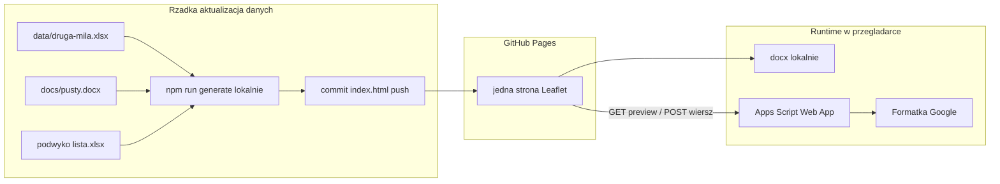

# ARCHITECTURE.md — Druga Mila

> **Status:** Gotowy do implementacji (Faza 2) — decyzje techniczne zamknięte 2026-07-20  
> **Ostatnia aktualizacja:** 2026-07-20  
> **Na podstawie:** `docs/SPECIFICATION.md`  
> **Tworzony przez:** plan techniczny (wzorce UX z `arkusz-mapa`; **inny** model wdrożenia — strona statyczna)  
> **Zatwierdzony przez:** (podpis biznesowy — checklista na dole)

---

## Cel Techniczny

**Jedna statyczna strona** mapowa na GitHub Pages, która:

1. Ma wbudowane punkty z Excela **Załadunek** (`data/druga-mila.xlsx`) — po rzadkim lokalnym buildzie.
2. Geokoduje adresy (cache) **tylko przy lokalnym** `npm run generate` (nie w cyklicznym CI).
3. Serwuje HTML (Leaflet): kolory CD / PLAC / puste / Bolęcin, search, filtr typu.
4. W przeglądarce: protokół Word (szablon DM) + POST do formatki Google — **bez** przebudowy strony.
5. Numeracja alfanumeryczna (`asd123` → `asd124`) przez Apps Script.
6. Reguła Bolęcin przy zbiórce zawierającej manualną (`manualna` / `manualna i automatyczna`) (JS modala).

Bez Symfony / Vue SPA / PostgreSQL w v1.  
Bez cyklicznej regeneracji jak w `arkusz-mapa` (brak schedule / cron → generate).

---

## Architektura wysokiego poziomu



| Warstwa | Technologia | Rola |
|---------|-------------|------|
| Punkty | Excel Załadunek w repo | Źródło pinezek + combobox; wbudowane w HTML przy buildzie |
| Podwykonawcy | `podwyko lista.xlsx` w repo | Przewoźnik / dostawa; wbudowane przy buildzie |
| Transporty | Google Sheets (formatka) + Apps Script | Numeracja, zapis wierszy (runtime) |
| Build | Node.js + TypeScript (lokalnie, rzadko) | Geocode, embed list, `buildMapHtml` → `index.html` w rootcie |
| UI | Leaflet w jednym HTML | Mapa, filtry, modal, Word |
| Hosting | GitHub Pages | Serwuje root brancha `main` (folder `/`; bez cyklicznego generate) |

---

## Dane

### Punkty — `data/druga-mila.xlsx` / arkusz Załadunek

| Kolumna | Użycie |
|---------|--------|
| A Nazwa pełna | Search, Sheets kontrahent, część Word |
| B Nazwa skrócona | Etykieta comboboxa, search |
| C Adres | Geocode (przy buildzie), search, Sheets adres, część Word |
| D Typ | `CD` / `PLAC` / puste → klasyfikacja koloru |

Klasyfikacja koloru (kolejność): Bolęcin (regex nazwa/adres) → CD → PLAC → puste.  
Hex: Bolęcin `#fd7e14`, CD `#0d6efd`, PLAC `#198754`, puste `#6f42c1`.

Wiersze bez C — pomijane na mapie i w comboboxie załadunku.

### Formatka Google

Wzór kolumn (offline): [`data/formatka-druga-mila.xlsx`](../data/formatka-druga-mila.xlsx). Mapowanie: [`FORMATKA_GOOGLE.md`](FORMATKA_GOOGLE.md) + SPEC.

**Docelowy arkusz online** (do niego Apps Script dopisuje wiersze):

- Nazwa: **lista-druga-mila**
- URL: `https://docs.google.com/spreadsheets/d/1-qRyFnpjvAI1pZYkVXOUKKV9oYlxGsLidDXCtxYWzS0/edit?usp=sharing`
- Spreadsheet ID: `1-qRyFnpjvAI1pZYkVXOUKKV9oYlxGsLidDXCtxYWzS0`
- Zakładka: `Arkusz1`
- Nagłówki (wiersz 1) **zweryfikowane** — 14 kolumn zgodnych z [`FORMATKA_GOOGLE.md`](FORMATKA_GOOGLE.md) / lokalnym wzorem: Numer faktury, Stawka, Czy protokół zrobiony, Nr zlecenia transportowego, Adres odbioru, Nazwa kontrahenta / podmiot handlowy, Data odbioru, Kto odbiera, Miejsce zrzutu, Rodzaj zbiórki, Ile worków, rodzaj traportu, awizacja, znacznik miejsca
- Apps Script Web App powinien być **container-bound** do tego arkusza (albo standalone + `SpreadsheetApp.openById('1-qRyFnpjvAI1pZYkVXOUKKV9oYlxGsLidDXCtxYWzS0')`).

> Uwaga: wcześniejszy link (`11OQsQn-…` / lista-druga-mila2) był błędny / niedostępny — nie używać.

### Word

[`pusty.docx`](pusty.docx) + [`SZABLON_WORD_tagi.md`](SZABLON_WORD_tagi.md).  
Tagi: `numer_zlecenia_transportowego`, `miejsce_zaladunku`, `przewoznik`, `miejsce_dostawy`, `dane_do_awizacji`, `data_zaladunku`.

### Listy jak arkusz-mapa

[`docs/podwyko lista.xlsx`](podwyko%20lista.xlsx) — kopia pliku z `arkusz-mapa/docs/` (A = UI, B = treść do Word): przewoźnik + miejsce dostawy. Zawiera wiersz „Biosystem” (adres w Bolęcinie) używany do reguły domyślnej dostawy przy zbiórce manualnej. Aktualizacja listy = edycja pliku + lokalny rebuild (jak punkty).

### Cache geokodu

| Element | Wartość |
|---------|---------|
| Plik | **`data/geocode-cache.json`** (commitowany) |
| Env (opcjonalnie) | `GEOCODE_CACHE_PATH` — domyślnie `./data/geocode-cache.json` |
| Model | Uproszczony wzorzec `arkusz-mapa` phase5: klucz = znormalizowany adres → `{ lat, lon, status, … }` |
| Odświeżanie | Tylko przy lokalnym `npm run generate` |

**Bez** Actions cache jako głównego mechanizmu.

---

## Zmienne środowiskowe

Plik: [`.env.example`](../.env.example). Lokalnie: `.env` (nie commitować).

| Zmienna | Wymagana | Opis |
|---------|----------|------|
| `DRUGA_MILA_WEBAPP_URL` | Do zapisu Sheets / auto-numeru | URL Web App (`…/exec`). Bez niej: Word lokalnie, bez POST / bez podglądu numeru |
| `GOOGLE_FORMATKA_SHEETS_ID` | Nie (dokumentacja) | `1-qRyFnpjvAI1pZYkVXOUKKV9oYlxGsLidDXCtxYWzS0` |
| `GEOCODE_CACHE_PATH` | Nie | Domyślnie `./data/geocode-cache.json` |
| `OUTPUT_HTML` | Nie | Domyślnie `./index.html` (root = Pages) |
| `NOMINATIM_USER_AGENT` | Nie | Domyślnie stała w `config.ts` (nazwa + kontakt) |

Brak Service Account w v1 (punkty z Excela w repo). URL Web App jest **wbudowywany w HTML przy buildzie** (jak sekrety runtime w plombach, ale bez CI — wartość z lokalnego `.env`).

---

## API Apps Script (formatka)

Osobny Web App (nie współdzielić numeracji z mapą plomb).  
Deploy + kontrakt: [`FORMATKA_SHEET.md`](FORMATKA_SHEET.md). Kod: [`google-apps-script/formatka-log.gs`](../google-apps-script/formatka-log.gs).

| Metoda | Akcja | Opis |
|--------|-------|------|
| GET | `action=previewNumber` | Podgląd następnego numeru (**skan arkusza**, bez rezerwacji) |
| GET | `action=modalData` | **Tylko numer** `{ ok, numer }` — **bez** `lastTransportDate` (DM nie filtruje plomb) |
| POST | JSON, `Content-Type: text/plain` | LockService → append → zwrot `{ ok, numer }` (numer zużyty dopiero po zapisie) |

> `modalData` w plombach zwraca też ostatnią datę transportu. W DM **nie** — endpoint zostaje dla spójności UX (jeden GET przy otwarciu modala), ale payload to wyłącznie podgląd numeru.

### Numeracja alfanumeryczna (zamknięte)

| Element | Decyzja |
|---------|---------|
| Start (pusty arkusz / brak numerów) | **`DM1`** |
| Źródło prawdy | Kolumna „Nr zlecenia” w arkuszu (skan przy preview i POST) |
| Script Property `formatkaLastNumber` | Cache po udanym zapisie — **nie** pali numerów przy podglądzie |
| Regex | `^(.*?)(\d+)$` → prefiks + liczba; samo `\d+` → prefiks pusty |
| Auto next | Inkrement względem max w arkuszu; v1 **bez** paddingu zer (`DM9`→`DM10`, `ABC100`→`ABC101`) |
| Z mapy | **Zawsze auto-numer** przy generacji |
| Podgląd | Nie rezerwuje / nie „pali” numeru |
| Usunięcie wierszy | Następny numer **cofa się** do luk (max pozostałych + 1) |
| Ręczny `numer` w POST | Tylko awaryjnie (API); mapa v1 nie polega na nadpisie |
| Mieszane prefiksy (v1) | **Zaakceptowane:** max po liczbie końcowej; remis → późniejszy wiersz |

Body POST (kierunek pól):

```json
{
  "numer": "DM2",
  "numerFaktury": "",
  "stawka": "…",
  "czyProtokolZrobiony": "tak",
  "adresOdbioru": "…",
  "nazwaKontrahenta": "…",
  "dataOdbioru": "20.07.2026",
  "ktoOdbiera": "…",
  "miejsceZrzutu": "…",
  "rodzajZbiorki": "manualna",
  "ileWorkow": "10",
  "rodzajTransportu": "…",
  "awizacja": "WX12345",
  "znacznikMiejsca": "CD"
}
```

`numerFaktury` — zawsze puste (brak UI). `stawka` — z pola modala (opcjonalne; nie w Word). `znacznikMiejsca` — typ z kolumny D Załadunek (`CD` / `PLAC` / puste).

---

## Frontend (mapa HTML)

| Feature | Kierunek implementacji |
|---------|------------------------|
| Kolor / legenda | Klasyfikacja z SPEC |
| Search mapy | Port `normalizeForAddressSearch` / `mapPointMatchesSearch` |
| Filtr typu | Jak `ZbiorkaFilterMode` — tryby: wszystkie, cd, plac, puste, bolecin |
| Combobox załadunku | Etykieta = skrócona; filter po A+B+C; value niesie A, B, C |
| Word payload | `miejsce_zaladunku = pełna + " " + adres` |
| Przewoźnik / dostawa | Combobox jak phase6 + `podwyko` |
| Stawka | Input w modalu → kolumna Google; **nie** w docxtemplater |
| Zbiórka | Combobox 3 wartości; nie w docxtemplater |
| Awizacja | Input text, bez walidacji |
| Bolęcin default | Przy zbiórce zawierającej manualną (`manualna` lub `manualna i automatyczna`) ustaw dostawę na wpis **„Biosystem”** z `podwyko lista.xlsx` (adres tej pozycji = Bolęcin); na liście nie ma wiersza nazwanego literalnie „Bolęcin”. Przy czystej `automatyczna` — brak auto-podstawienia |
| Bulk | Multi-select → pętla POST + docx |
| Word | PizZip + docxtemplater; szablon base64 w HTML |

Wszystkie pola opcjonalne — brak `alert` wymagalności przy generacji.

### Reuse vs fork

- Reuse: search, combobox, Word w przeglądarce, Apps Script pattern.
- Nie kopiować: pipeline plomb, kolor wg worków, lista plomb, filtr zbiórki worków, **cykliczne CI generate + cron**, **workflow deployu Pages przez Actions** (`arkusz-mapa-pages.yml`) — tu Pages serwuje branch bezpośrednio.

---

## Build, aktualizacja danych i GitHub Pages

### Model (wariant A — lokalny rebuild)

```
Edycja druga-mila.xlsx / podwyko lista.xlsx
  → lokalnie: npm run generate (geocode + buildMapHtml + embed docx/podwyko)
  → commit index.html w rootcie (+ cache geokodu)
  → push
  → GitHub Pages serwuje root (folder /)
```

| Element | Decyzja |
|---------|--------|
| Charakter strony | Statyczna; jedna mapa HTML (`index.html` w rootcie) |
| Kiedy rebuild | Tylko gdy zmienia się Excel punktów lub `podwyko` / szablon Word |
| Kiedy **nie** rebuild | Przy generacji protokołu / zapisie do Sheets |
| Publikacja na Pages | **Bez GitHub Actions.** Ustawienie: *Settings → Pages → Source: „Deploy from a branch”*, branch `main`, folder **`/ (root)`**. GitHub przy branch deploy obsługuje wyłącznie `/` lub `/docs` — **nie** dowolnego `/site` |
| GitHub Actions | Nieużywane w v1 (brak schedule, brak workflow deployu — push `index.html` wystarcza) |
| Sekrety runtime | URL Web App formatki wbudowany przy buildzie (z lokalnego `.env`) — bez GitHub Secrets, bo nie ma CI |
| URL | np. `https://zotrek.github.io/druga-mila/` |

Źródło punktów v1: plik w repo. Ewentualna synchronizacja ze Sheets — później (nadal bez cyklicznego CI jak plomby, chyba że świadomie zmienimy model).

### Workflow aktualizacji (dla utrzymującego dane)

1. Zmień `data/druga-mila.xlsx` i/lub `docs/podwyko lista.xlsx`.
2. Uruchom lokalnie `npm run generate`.
3. Commit zmian (`index.html`, ewentualnie cache geokodu).
4. Push — Pages pokazuje zaktualizowaną listę pinezek / comboboxów.

---

## Bezpieczeństwo

| Temat | v1 |
|-------|-----|
| Dostęp mapy | Publiczny Pages |
| Zapis | Apps Script Web App (polityka jak transport-log) |
| Sekrety | URL Web App w buildzie / `.env` lokalnie; bez Service Account do punktów w v1 |
| Walidacja pól | Brak wymagalności; awizacja bez regex |

---

## Ryzyka

| Ryzyko | Mitygacja |
|--------|-----------|
| Kolizja numeracji z mapą plomb | Osobny arkusz + osobny Web App |
| Prefiksy numerów mieszane | Zaakceptowane: max po liczbie końcowej w arkuszu |
| Usunięte numery / „palenie” | Źródło prawdy = arkusz; preview nie rezerwuje; delete → cofnięcie |
| Geocode / Nominatim | Cache commitowany; rebuild tylko przy zmianie Excela |
| Zapomniany rebuild po edycji Excela | Dokumentacja workflow; Pages pokazuje stare dane do następnego generate |
| Wiersze bez adresu w Excelu | Pomijane na mapie |

---

## Moduły `src/` (mapa plików)

| Plik | Odpowiedzialność |
|------|------------------|
| `src/config.ts` | Env, ścieżki, hex kolorów, UA Nominatim, nazwy arkuszy Excel |
| `src/classify.ts` | Klasyfikacja koloru: Bolęcin → CD → PLAC → puste |
| `src/readPoints.ts` | Odczyt `druga-mila.xlsx` (Załadunek); pomijanie pustego C |
| `src/readPodwyko.ts` | Odczyt `podwyko lista.xlsx` (A=UI, B=Word) |
| `src/geocode.ts` | Nominatim + rate limit + `data/geocode-cache.json` |
| `src/buildMapHtml.ts` | Szablon Leaflet: pinezki, legenda, search, filtr, modal, embed docx/podwyko/URL Web App |
| `src/run.ts` | Pipeline CLI: points → geocode → build → zapis `index.html` |
| `src/nextNumber.ts` | Czysta funkcja inkrementu alfanumerycznego (testowana; lustro logiki `.gs`) |
| `src/searchNormalize.ts` | Port `normalizeForAddressSearch` / match z `arkusz-mapa` |
| `src/*.test.ts` | Vitest |

**Reuse z `arkusz-mapa` (port, nie zależność runtime):** search normalize, combobox UX, PizZip+docxtemplater w przeglądarce, wzorzec Web App.  
**Nie kopiować:** pipeline plomb, filtr worków, lastTransportDate, CI/cron Pages.

### Zależności npm (v1)

| Pakiet | Rola |
|--------|------|
| `xlsx` | Odczyt Excel |
| `dotenv` | `.env` |
| `typescript`, `tsx`, `@types/node` | Build / CLI |
| `vitest` | Testy |
| (w HTML CDN lub embed) | Leaflet, PizZip, docxtemplater — jak w mapie plomb |

### Skrypty npm

| Skrypt | Komenda | Opis |
|--------|---------|------|
| `generate` | `tsx src/run.ts` | Pełny lokalny rebuild → `index.html` |
| `build` | `tsc --noEmit` (lub `tsc`) | Sprawdzenie typów |
| `test` | `vitest run` | Testy jednostkowe |

---

## Strategia testów

| Warstwa | Co | Narzędzie |
|---------|-----|-----------|
| Unit | `nextNumber` (brak→`DM1`, `DM1`→`DM2`, `asd123`→`asd124`, `ABC100`→`ABC101`; skan max po usunięciu) | Vitest |
| Unit | `classify` (kolejność Bolęcin / CD / PLAC / puste) | Vitest |
| Unit | Search normalize + match | Vitest |
| Unit | Parse wiersza Załadunek / pomijanie pustego C | Vitest |
| Manual / smoke | `npm run generate` lokalnie; otwarcie `index.html`; modal Word; POST do Web App | Checklist w `-tasks.md` |
| Poza v1 | E2E przeglądarkowy, CI | — |

---

## Struktura katalogów

```
druga-mila/
  index.html                  # wynik lokalnego generate / placeholder Pages — root = publikacja
  .env.example
  docs/SPECIFICATION.md
  docs/ARCHITECTURE.md
  docs/FORMATKA_GOOGLE.md
  docs/FORMATKA_SHEET.md      # deploy Apps Script + API
  docs/SZABLON_WORD_tagi.md
  docs/pusty.docx
  docs/podwyko lista.xlsx
  data/druga-mila.xlsx
  data/formatka-druga-mila.xlsx
  data/geocode-cache.json     # po pierwszym generate
  src/                        # implementacja
  google-apps-script/formatka-log.gs
```

Brak katalogu `.github/workflows/` w v1 — publikacja przez Pages „Deploy from a branch” + folder `/ (root)`. Brak folderu `site/` — GitHub nie pozwala wybrać go jako źródła Pages.

---

## Zatwierdzenie

**Zamknięte (2026-07-20):** start `DM1`, mieszane prefiksy OK, auto z mapy, preview nie pali, delete cofa numerację, env/cache/moduły/testy, kontrakt Apps Script, model statyczny Pages.

- [x] Plan techniczny uzupełniony (moduły, env, cache, testy, numeracja)
- [x] Numer startowy = `DM1`
- [x] Formatka Google i reguła mieszanych prefiksów zaakceptowane biznesowo
- [x] Model statyczny (lokalny rebuild, bez cyklicznego CI) zaakceptowany
- [x] Gotowy do implementacji kodu (Faza 1 scaffold)

**Zatwierdzający:** użytkownik (decyzje 2026-07-20) + dokumentacja w repo

---

**Stack v1:** Node.js + TypeScript (rzadki lokalny build) | Leaflet (statyczny HTML) | Excel w repo + Google Sheets | Apps Script | GitHub Pages (branch source, bez Actions)  
**Nie:** GitHub Actions (ani cykliczne, ani deploy) | Symfony | Vue | PostgreSQL
